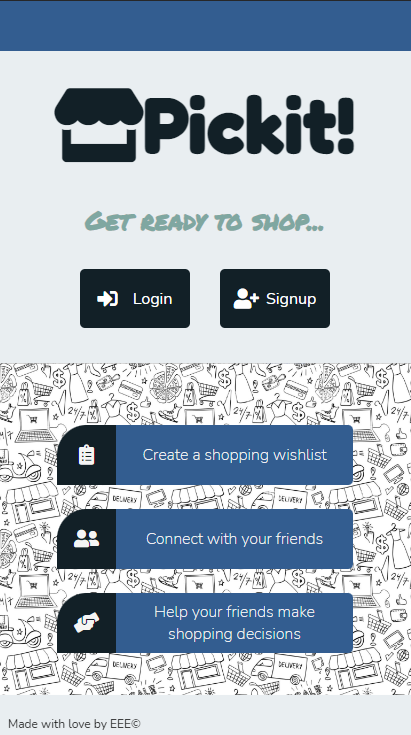
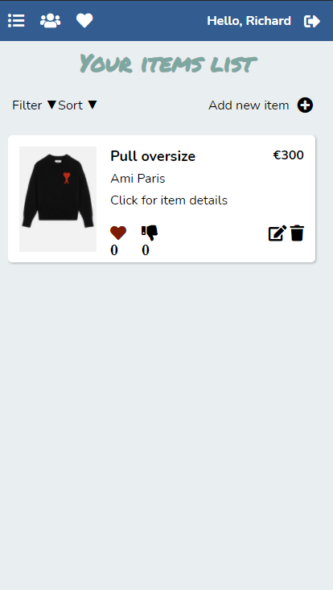
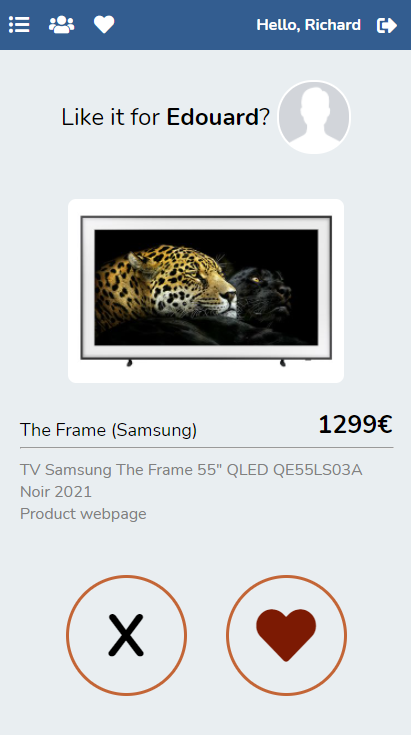
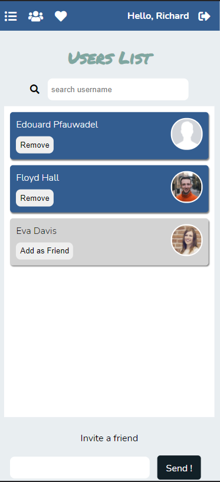

# PICKIT

> Pickit is a mobile designed social app to add an item list and let your friend decide if they like it or not

## Table of contents

- [General info](#general-info)
- [Screenshots](#screenshots)
- [Technologies](#technologies)
- [Setup](#setup)
- [Features](#features)
- [Status](#status)
- [Contact](#contact)

## General info

This app is a group project at IronHack Bootcamp;
It was meant to train us about routing, nodejs, handlebars templating and axios;
You can find the deployed version [@here](https://pickitapp.herokuapp.com/)

## Screenshots

## Technologies

- Axios - version 0.19.2
- HBS - version 4.0.1
- Cloudinary - version 1.23.0

## Setup

- $npm i
- $npm start

## Features

List of features ready and TODOs for future development

- Random roulette for likes and dislikes of items
- Friends system
- Responsive

## Status

Project is: _completed_

## Contact

Created by [@lepfau](https://www.github.com/lepfau) - feel free to contact me!
